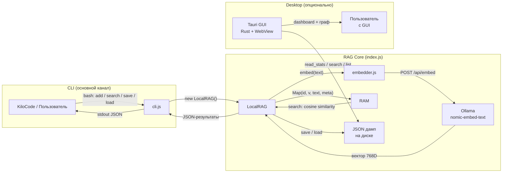
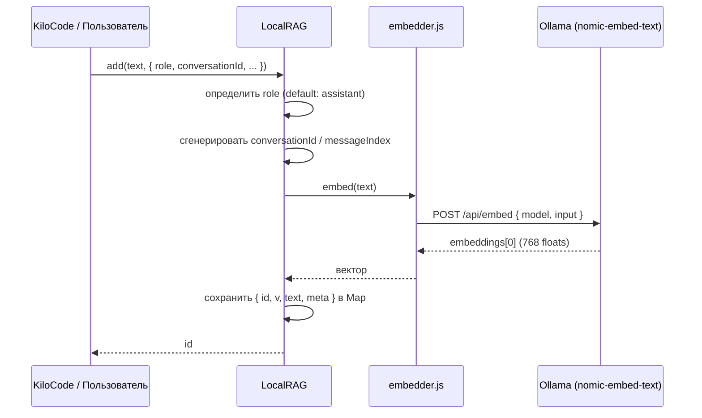
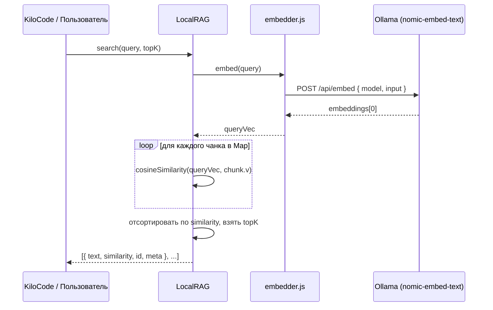
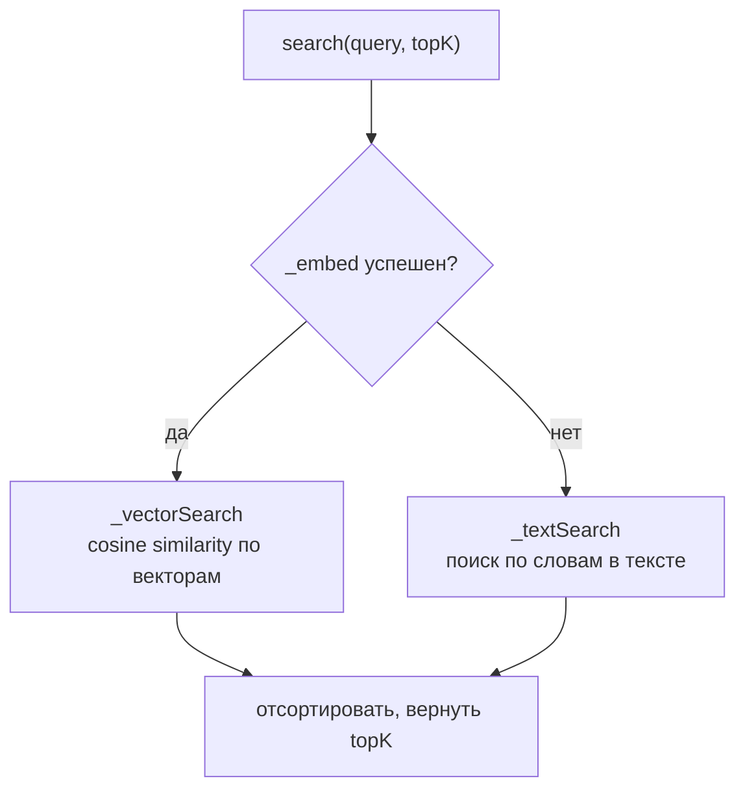
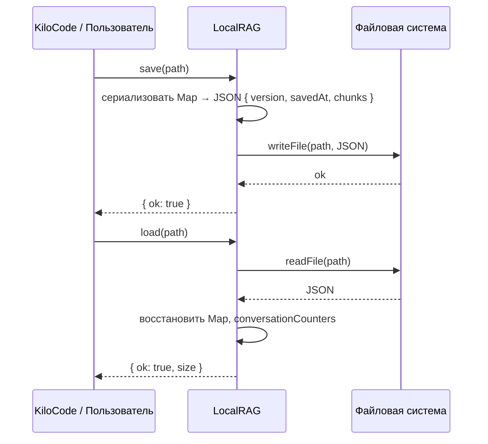
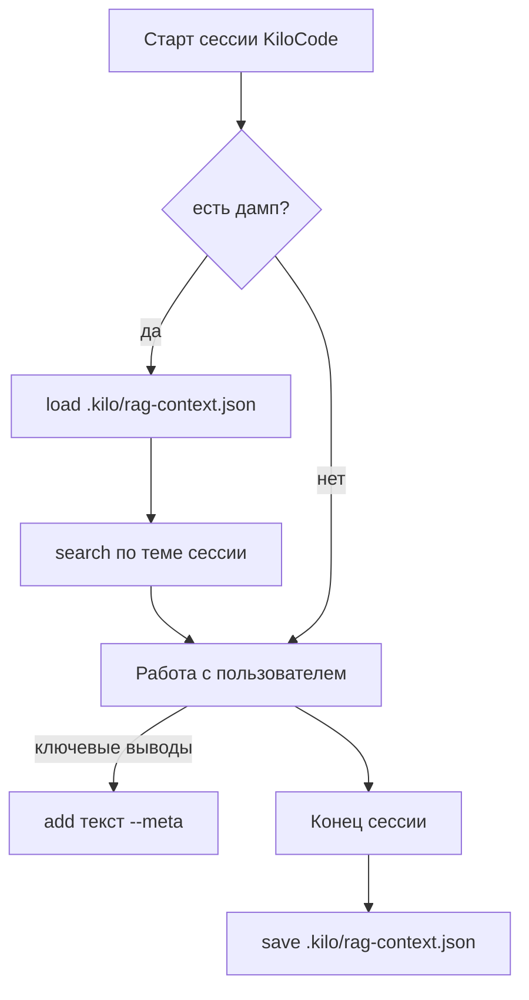
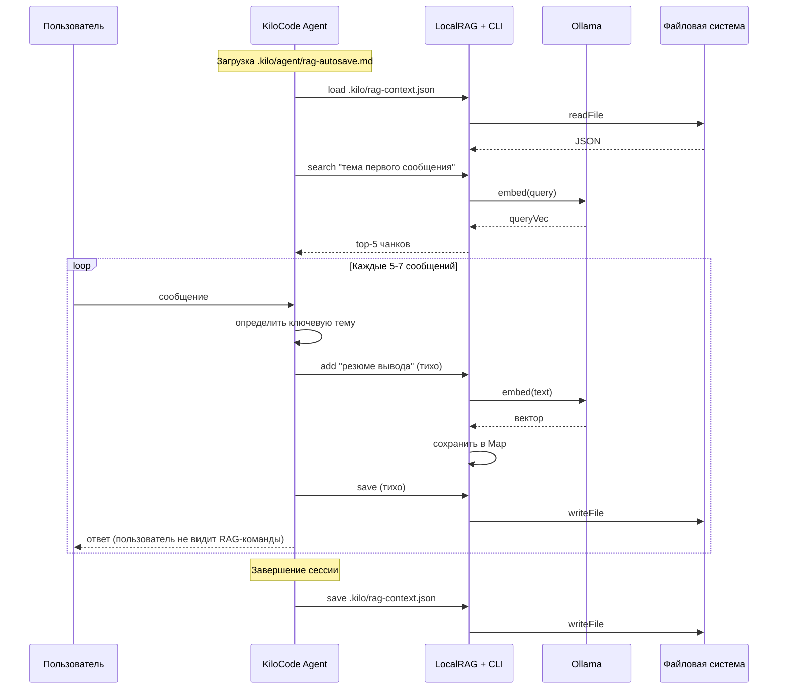
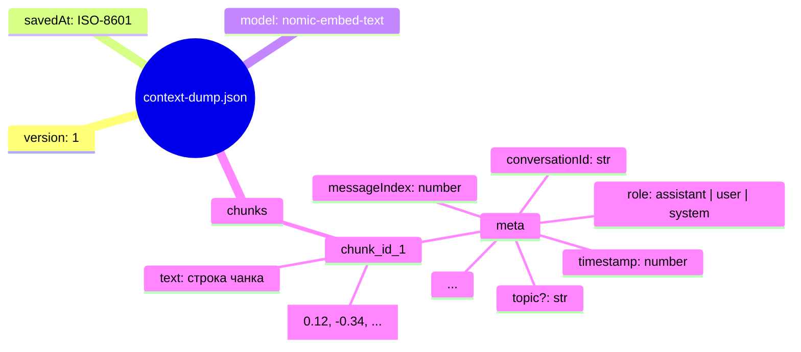

# Схемы local-rag-store

| № | Раздел | Описание |
|---|--------|----------|
| 1 | [О системе](#о-системе) | Назначение, принцип работы, опциональность Desktop |
| 2 | [Архитектура](#архитектура-cli--опциональный-desktop) | CLI + RAG Core + Desktop + Ollama — общая схема |
| 3 | [Data Flow: add()](#data-flow-add) | Последовательность операций при добавлении чанка |
| 4 | [Data Flow: search()](#data-flow-search) | Эмбеддинг запроса, cosine similarity, возврат результатов |
| 5 | [Data Flow: save / load](#data-flow-save--load) | Персистентность: запись и чтение JSON-дампа |
| 6 | [CLI Lifecycle](#cli-lifecycle-интеграция-с-kilocode) | Жизненный цикл сессии KiloCode через CLI |
| 7 | [Auto-Save Workflow](#auto-save-workflow) | Автосохранение через `.kilo/agent/rag-autosave.md` |
| 8 | [Desktop Monitor](#desktop-monitor-опционально) | Tauri GUI: Dashboard, Explorer, Graph |
| 9 | [Структура JSON-дампа](#структура-json-дампа) | Формат файла: version, chunks, meta |
| 10 | [Полная диаграмма компонентов](#полная-диаграмма-компонентов) | Все модули, их связи и внешние зависимости |

---

## О системе

`local-rag-store` — локальное RAG-хранилище для сохранения и поиска контекста диалогов с LLM.

### Как работает

1. **CLI** (`cli.js`) — основной инструмент. Агент (KiloCode) или пользователь вызывает команды через bash: добавляет ключевые выводы, ищет релевантные чанки, сохраняет дамп.
2. **LocalRAG** (`index.js`) — ядро. Хранит векторы в RAM (Map), превращает текст в эмбеддинги через Ollama, ищет косинусным сходством.
3. **JSON-дамп** — файл на диске. CLI сохраняет/загружает всё состояние сессии.
4. **Десктоп-монитор** (`desktop/`) — опциональный Tauri GUI. Читает тот же JSON-дамп, показывает статистику и связи. **Не обязателен** — CLI полностью покрывает просмотр содержимого.

### CLI достаточен для просмотра

```bash
# Поиск по тексту
node cli.js search "что обсуждали про архитектуру" --top 5

# Поиск без эмбеддинга (все чанки)
node cli.js search "" --top 100

# Посмотреть размер хранилища
node cli.js list  # (если реализовано)
```

Десктоп-приложение — исключительно для тех, кому удобнее визуальный интерфейс. Пользоваться или нет — личное желание.

---

## Архитектура (CLI + опциональный Desktop)



## Data Flow: add()



## Data Flow: search()



## Data Flow: search fallback (без Ollama)

Если Ollama недоступен, `search()` автоматически переключается на текстовый поиск. Без ошибок, пустых результатов — просто менее точное совпадение.



Текстовый поиск разбивает запрос на слова, ищет каждое слово в тексте чанков и считает долю совпавших слов.

---

## Data Flow: save / load (с бэкапом)

При сохранении старый дамп автоматически переименовывается в `.bak` перед перезаписью. Однажды спасёт от потери данных.



## CLI Lifecycle (интеграция с KiloCode)



## Auto-Save Workflow

Автоматическое сохранение через `.kilo/agent/rag-autosave.md`. Агент читает инструкцию при старте и выполняет add()/save() без вмешательства пользователя.



## Desktop Monitor (опционально)

```mermaid
flowchart LR
    subgraph GUI ["Tauri Desktop App"]
        direction TB
        D1[Dashboard\nчанки / диалоги / RAM]
        D2[Explorer\nпоиск по тексту, роли]
        D3[Graph\nсвязи между чанками]
        D4[Conversations\nсписок диалогов]
    end

    JSON[JSON дамп\nна диске] -->|Rust: read / search| GUI
    GUI -->|кнопка| CLEAR[Очистить с бэкапом]
    GUI -->|кнопка| REFRESH[Перечитать дамп]

    style GUI fill:#2a3d35,stroke:#7a9a92
    style JSON fill:#474a50,stroke:#7a9a92
```



## Структура JSON-дампа



## Полная диаграмма компонентов

```mermaid
flowchart TB
    subgraph User["Пользователь"]
        UA[Агент KiloCode]
        UH[Человек]
    end

    subgraph CLI_Layer["CLI (Node.js)"]
        CLI[cli.js\nadd / search / save / load / clear / remove]
        INDEX[index.js\nclass LocalRAG]
        EMBED[embedder.js\nOllama HTTP client]
    end

    subgraph Desktop_Layer["Desktop (Tauri/Rust) — опционально"]
        TAURI[lib.rs\nread_stats / search_chunks\nget_related / list_conversations]
        HTML[index.html + style.css + app.js\nDashboard / Explorer / Graph]
    end

    subgraph Storage["Хранилище"]
        JSON_FILE[JSON-дамп на диске]
        RAM[Map в оперативной памяти]
    end

    subgraph External["Внешние зависимости"]
        OLLAMA[Ollama\nnomic-embed-text\nlocalhost:11434]
    end

    UA -->|bash| CLI
    UH -->|запуск exe| TAURI

    CLI --> INDEX
    INDEX --> EMBED
    EMBED --> OLLAMA
    INDEX --> RAM
    INDEX --> JSON_FILE

    TAURI --> JSON_FILE
    HTML --> TAURI

    style Desktop_Layer fill:#2a3d35,stroke:#7a9a92,stroke-dasharray: 5 5
    style User fill:#3b3f45,stroke:#9aa8b5
    style External fill:#3d2430,stroke:#b89ac8
```



> **Примечание:** Desktop-монитор — опциональная надстройка. Для просмотра содержимого достаточно CLI-команд. Пользоваться GUI или нет — исключительно личное предпочтение.
