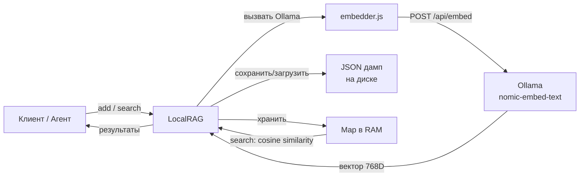
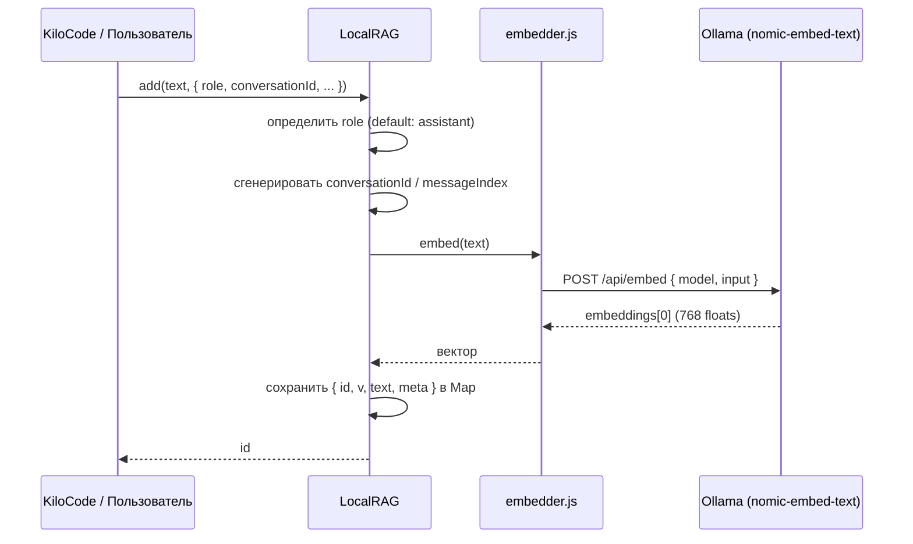
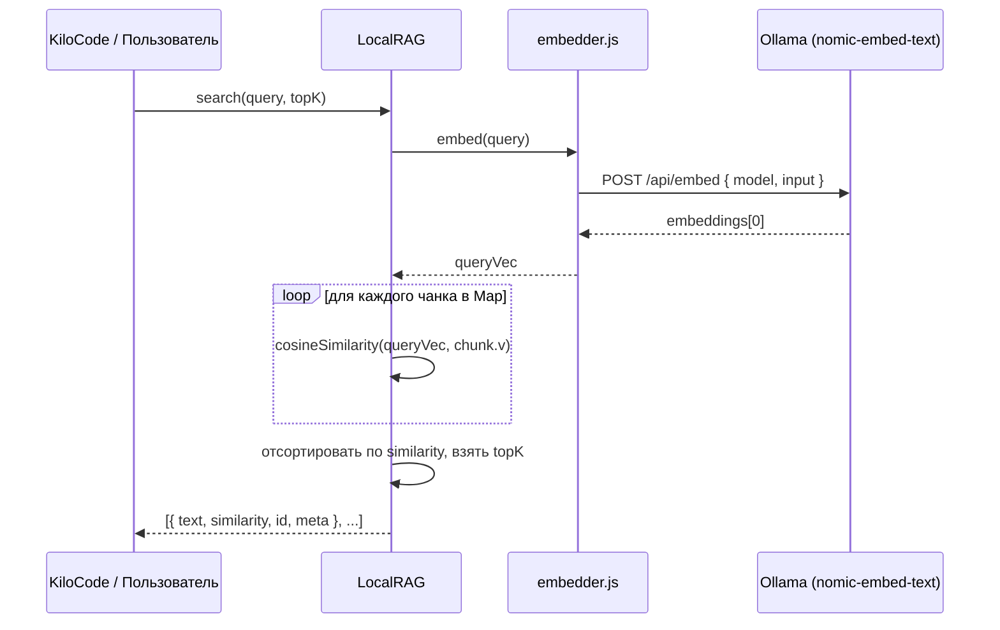
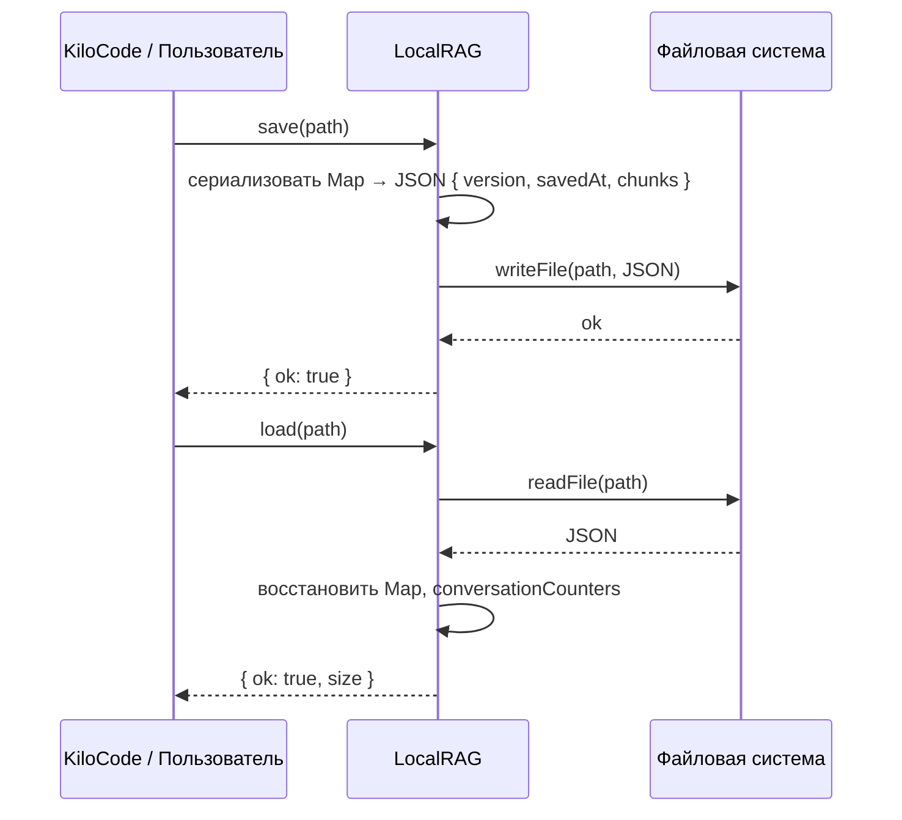
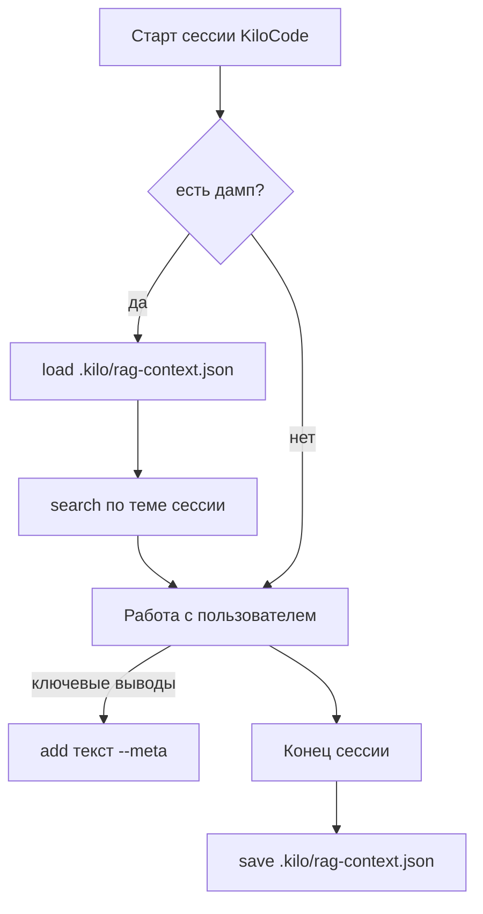
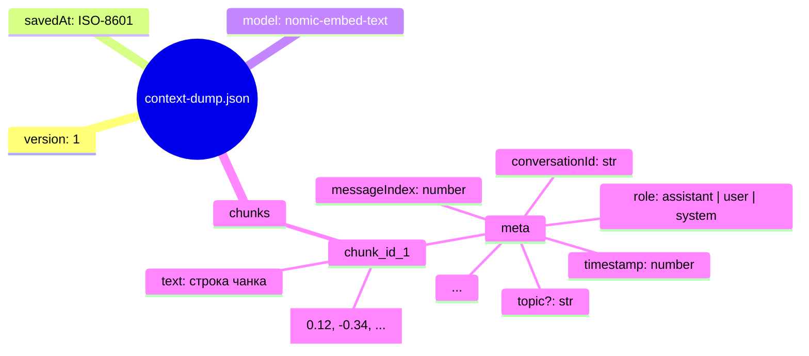

# Схемы local-rag-store

## Архитектура

```mermaid
flowchart LR
    A[Клиент / Агент] -->|add / search| B[LocalRAG]
    B -->|вызвать Ollama| C[embedder.js]
    C -->|POST /api/embed| D[Ollama\nnomic-embed-text]
    D -->|вектор 768D| B
    B -->|сохранить/загрузить| E[JSON дамп\nна диске]
    B -->|хранить| F[Map в RAM]
    F -->|search: cosine similarity| B
    B -->|результаты| A
```

## Data Flow: add()

```mermaid
sequenceDiagram
    participant Agent as KiloCode / Пользователь
    participant RAG as LocalRAG
    participant Embed as embedder.js
    participant Ollama as Ollama (nomic-embed-text)

    Agent->>RAG: add(text, { role, conversationId, ... })
    RAG->>RAG: определить role (default: assistant)
    RAG->>RAG: сгенерировать conversationId / messageIndex
    RAG->>Embed: embed(text)
    Embed->>Ollama: POST /api/embed { model, input }
    Ollama-->>Embed: embeddings[0] (768 floats)
    Embed-->>RAG: вектор
    RAG->>RAG: сохранить { id, v, text, meta } в Map
    RAG-->>Agent: id
```

## Data Flow: search()

```mermaid
sequenceDiagram
    participant Agent as KiloCode / Пользователь
    participant RAG as LocalRAG
    participant Embed as embedder.js
    participant Ollama as Ollama (nomic-embed-text)

    Agent->>RAG: search(query, topK)
    RAG->>Embed: embed(query)
    Embed->>Ollama: POST /api/embed { model, input }
    Ollama-->>Embed: embeddings[0]
    Embed-->>RAG: queryVec
    loop для каждого чанка в Map
        RAG->>RAG: cosineSimilarity(queryVec, chunk.v)
    end
    RAG->>RAG: отсортировать по similarity, взять topK
    RAG-->>Agent: [{ text, similarity, id, meta }, ...]
```

## Data Flow: save / load

```mermaid
sequenceDiagram
    participant Agent as KiloCode / Пользователь
    participant RAG as LocalRAG
    participant FS as Файловая система

    Agent->>RAG: save(path)
    RAG->>RAG: сериализовать Map → JSON { version, savedAt, chunks }
    RAG->>FS: writeFile(path, JSON)
    FS-->>RAG: ok
    RAG-->>Agent: { ok: true }

    Agent->>RAG: load(path)
    RAG->>FS: readFile(path)
    FS-->>RAG: JSON
    RAG->>RAG: восстановить Map, conversationCounters
    RAG-->>Agent: { ok: true, size }
```

## CLI Lifecycle (интеграция с KiloCode)

```mermaid
flowchart TD
    Start[Старт сессии KiloCode] --> Load{есть дамп?}
    Load -->|да| Load_file[load .kilo/rag-context.json]
    Load_file --> Search[search по теме сессии]
    Search --> Work[Работа с пользователем]
    Load -->|нет| Work

    Work -->|ключевые выводы| Add[add текст --meta]

    Work --> End[Конец сессии]
    End --> Save[save .kilo/rag-context.json]
```

## Структура JSON-дампа

```mermaid
mindmap
  root((context-dump.json))
    version: 1
    savedAt: ISO-8601
    model: nomic-embed-text
    chunks
      chunk_id_1
        v: [0.12, -0.34, ...]
        text: строка чанка
        meta
          role: assistant | user | system
          conversationId: str
          timestamp: number
          messageIndex: number
          topic?: str
          ...
```
